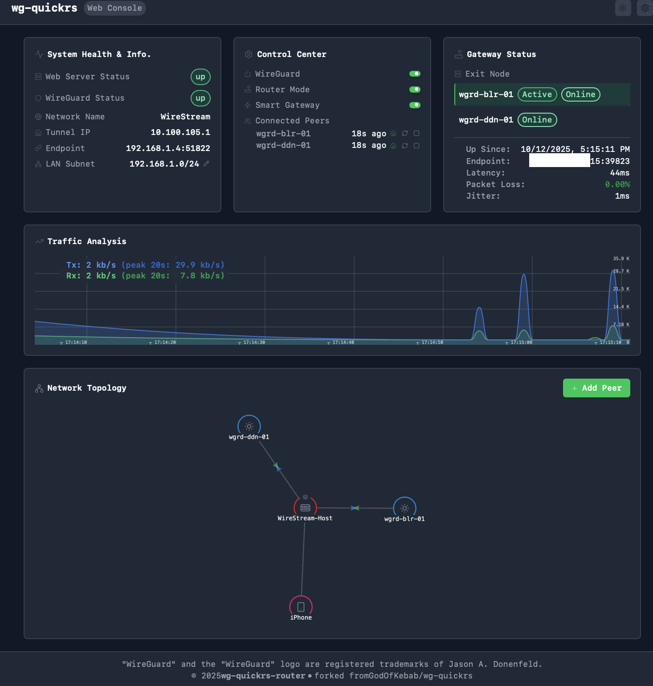

# wg-quickrs (Gateway Edition)

> 🔀 A WireGuard management tool with Router Mode for CGNAT/cellular peers

**Latest Release:** [v2.0.1-router](https://github.com/grizzy255/wg-quickrs-router/releases/tag/v2.0.1-router)

## 🆕 What's New in v2.0

### Smart Gateway (Auto-Failover)
- **⚡ Auto-Failover** — Automatically switches to a healthy gateway when current one fails (after 3 consecutive ping failures, ~3 seconds)
- **🔄 Auto-Failback** — Returns to your preferred gateway after 60 seconds of stability
- **📊 Improved Health Monitoring** — Changed offline detection from 1 ping to 3 consecutive failures (reduces false positives)
- **🔔 Confirmation Dialog** — Clear explanation of Smart Gateway behavior when enabling

---

## 🙏 Credits

- Original project: [GodOfKebab/wg-quickrs](https://github.com/GodOfKebab/wg-quickrs)
- Built with Rust, Vue.js, and WireGuard

> ⚠️ **Note:** This project was coded entirely with AI (Claude/Cursor). Please excuse any inefficiencies — contributions and improvements are welcome!

## 💡 What do I use it for?

- Pointing Apple TV to a Pi installed in my parents house to see Geo-blocked content.

---

## 🎯 Problem Statement

I wanted to use remote sites as exit nodes for internet traffic, but those sites were stuck behind **CGNAT** (cellular/ISP firewalls). This meant I couldn't just "dial in" to them.

### Technical Implications (UniFi Context)

| Mode | Limitation |
|------|------------|
| **Client Mode VPN** | Not possible for PBR on LAN hosts — remote site has no public IP to accept connections |
| **Server Mode VPN** | Peers can connect, but UniFi lacks granular PBR to control traffic flow per peer |

**The Goal:** A solution that acts as a rendezvous point for NAT-restricted peers while providing the advanced routing logic required to manage traffic flow.

---

## 🛠️ The Solution

**wg-quickrs Gateway Edition** acts as a central intelligent rendezvous point.

Deploy on a Linux host in your LAN with a public IP (or port forwarding) to:

1. **Get Around CGNAT** — Peers initiate outbound connections to this server
2. **Granular PBR** — Per-peer routing tables with overlapping route support
3. **Exit Node Selection** — Manually switch traffic to exit through the exit node
4. **LAN Bridging** — Automatic iptables masquerading to bridge peers into internal subnets
5. **Access Control** — Allow or deny LAN access per peer - Good for phones to be able to access Exit nodes, but not your LAN

```
                                                     ┌─────────────────────┐
                                                ┌───▶│  Exit Node Peer 1   │───▶ Internet
                                                │    │  (Remote Site/CGNAT)│     (via Peer 1 IP)
                                                │    └─────────────────────┘
┌─────────────────┐                             │
│  iPhone         │──┐                          │
│  (CGNAT/LTE)    │  │    ┌─────────────────────┴──┐
└─────────────────┘  │    │                        │
                     ├───▶│   wg-quickrs Gateway   │
┌─────────────────┐  │    │                        │
│  LAN Devices    │──┤    │  • Per-peer route table│
│    Apple TV     │  │    │  • Exit node selector  │    ┌─────────────────────┐
└─────────────────┘  │    │  • LAN access control  │───▶│  LAN Resources      │
                     │    │  • Health monitoring   │    │  192.168.1.0/24     │
┌─────────────────┐  │    │                        │    │  10.0.0.0/8         │
│  Remote Site    │──┘    └─────────────────────┬──┘    └─────────────────────┘
│  (Branch Office)│                             │
└─────────────────┘                             │    ┌─────────────────────┐
                                                └───▶│  Exit Node Peer 2   │───▶ Internet
                                                     │  (Home/VPS/CGNAT)   │     (via Peer 2 IP)
                                                     └─────────────────────┘
```

**Traffic Flow:**
- iPhone → Gateway → Exit Peer 1 → Internet *(appears as Peer 1's IP)*
- LAN Devices → Gateway → Exit Peer 1 → Internet *(appears as Peer 1's IP)*
- Switch between Exit Peer 1 ↔ Exit Peer 2 on-the-fly from the dashboard

---

## 📸 Screenshots



---

## ✨ Features

### Core WireGuard Management
- **Multi-peer support** — Manage peers from one interface
- **Interactive network graph** — Visual P2P network topology
- **QR codes & .conf export** — Easy peer provisioning
- **HTTPS & JWT auth** — Secure web access with password login

### Router Mode (This Fork)
- **Web init mode** — Launch the binary and configure from the Web
- **Exit node selection** — Route all peer traffic through a selected peer dynamically
- **Smart Gateway** — Auto-failover to healthy gateway + auto-failback after 60s stability
- **Per-peer routing tables** — Each peer gets an isolated routing table (avoids conflicts)
- **Overlapping route support** — Multiple 0.0.0.0/0 routes coexist in separate tables
- **Per-peer LAN access** — Toggle home icon to allow/deny LAN access
- **Persistent settings** — LAN access, exit node, and Smart Gateway settings survive restarts
- **Pause and Restart peers** — Pause peer temporarily or reconnect them from GUI

### Monitoring & Dashboard
- **Real-time health metrics** — Latency, packet loss, jitter
- **Traffic graphs** — Enhanced with tooltips and grid lines
- **Three-card layout:**
  - System Health & Info (status, tunnel IP, LAN subnets)
  - Control Center (toggles, connected peers with controls)
  - Gateway Status (exit node health, uptime, endpoint)

---

## 🚀 Quick Start

### Prerequisites

```bash
# Install dependencies
sudo apt install wireguard-tools iptables
```

### Manual Installation

**Step 1: Download the binary**
```bash
# Download latest release
curl -L -o wg-quickrs https://github.com/grizzy255/wg-quickrs-router/releases/latest/download/wg-quickrs-linux-amd64

# Move to system path and make executable
sudo mv wg-quickrs /usr/local/bin/
sudo chmod +x /usr/local/bin/wg-quickrs

# Verify installation
wg-quickrs --version
```

**Step 2: Create systemd service**
```bash
sudo tee /etc/systemd/system/wg-quickrs.service > /dev/null << 'EOF'
[Unit]
Description=wg-quickrs WireGuard Gateway
After=network.target

[Service]
Type=simple
ExecStart=/usr/local/bin/wg-quickrs agent run --config /etc/wireguard/wg-quickrs.yaml
Restart=on-failure
RestartSec=5
StandardOutput=journal
StandardError=journal

[Install]
WantedBy=multi-user.target
EOF
```

**Step 3: Enable and start the service**
```bash
sudo systemctl daemon-reload
sudo systemctl enable wg-quickrs
sudo systemctl start wg-quickrs

# Check status
sudo systemctl status wg-quickrs

# View logs
sudo journalctl -u wg-quickrs -f
```

**Step 4: Access the Web UI**

Web UI accessible at `http://<your-ip>:80`

---

## 📁 Configuration

- **Config file:** `/etc/wireguard/wg-quickrs.yaml`
- **Router Mode state:** `/etc/wireguard/router_mode_state.json`

---

## 📄 License

GPL-3.0 — See [LICENSE.txt](LICENSE.txt)

---

<sub>"WireGuard" and the "WireGuard" logo are registered trademarks of Jason A. Donenfeld.</sub>
