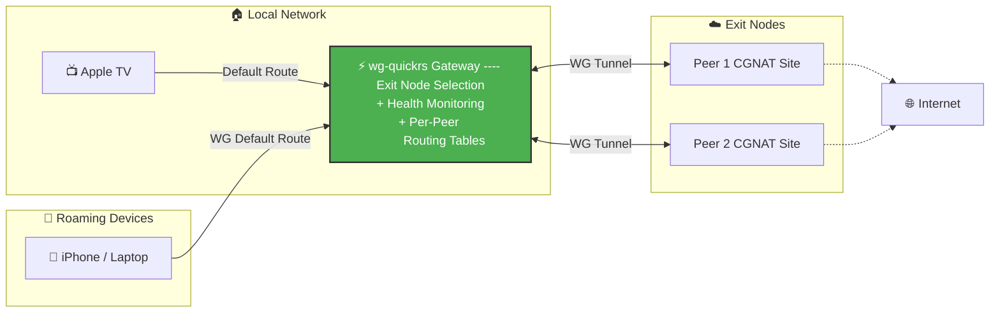

# wg-quickrs (Gateway Edition)

> 🔀 **Smart WireGuard Routing:** A management tool designed to bypass CGNAT and master Policy-Based Routing.

[](https://github.com/grizzy255/wg-quickrs-router/releases)
[](LICENSE.txt)

**wg-quickrs Gateway** transforms a standard Linux host into an intelligent VPN rendezvous point. It solves the headache of connecting to peers behind cellular/ISP firewalls (CGNAT) while maintaining granular control over your LAN traffic.

---

## 🚀 Features

* **⚡ Smart Gateway:** Auto-failover to healthy gateways (3s detection) and auto-failback when stability returns.
* **🌉 CGNAT Traversal:** "Dial out" from restricted networks (LTE/Starlink) to this gateway to establish bi-directional connectivity.
* **🎯 Policy-Based Routing (PBR):** Assign specific LAN devices (e.g., Apple TV) to specific remote exit nodes.
* **🛡️ Per-Peer Isolation:** Each peer gets a dedicated routing table—no more route conflicts.
* **📊 Visual Dashboard:** Real-time health metrics (jitter/latency), topology graphs, and one-click controls.

---

## 💡 The Challenge

Standard WireGuard is great, but it struggles in complex "Road Warrior" or Site-to-Site scenarios involving **CGNAT** (Carrier-Grade NAT) and Policy based Routing.


In a Unifi setup 

1. **Client Mode VPNs** fail because the remote site (e.g., a cellular modem) has no public IP to accept connections.
2. **Server Mode VPNs** allow connection, but lack the granular routing logic (PBR) to decide *which* LAN traffic goes to *which* peer.

### The Solution

**wg-quickrs Gateway** acts as a central "Rendezvous Point." Remote peers connect *out* to the gateway, and the gateway intelligently routes LAN traffic back through them.



**Traffic Flow Example:**
- Apple TV ➔ Gateway ➔ Exit Peer 1 ➔ Internet *(Appears as Peer 1's IP)*
- Peer 1 down - Auto or Manual switchover
- Apple TV ➔ Gateway ➔ Exit Peer 2 ➔ Internet *(Appears as Peer 2's IP)*

---

## 📸 Dashboard


---

## 📦 Quick Start

### 1. Installation

The easiest way to run the gateway is using the pre-compiled binary.

```bash
# 1. Download the latest binary
sudo curl -L -o /usr/local/bin/wg-quickrs https://github.com/grizzy255/wg-quickrs-router/releases/latest/download/wg-quickrs-linux-amd64
sudo chmod +x /usr/local/bin/wg-quickrs

# 2. Install dependencies
sudo apt install wireguard-tools iptables
```

### 2. Service Setup

Create a persistent systemd service.

```bash
sudo tee /etc/systemd/system/wg-quickrs.service > /dev/null << 'EOF'
[Unit]
Description=wg-quickrs WireGuard Gateway
After=network.target

[Service]
Type=simple
ExecStart=/usr/local/bin/wg-quickrs agent run --config /etc/wireguard/wg-quickrs.yaml
Restart=on-failure
RestartSec=5

[Install]
WantedBy=multi-user.target
EOF

sudo systemctl daemon-reload
sudo systemctl enable --now wg-quickrs
```

### 3. Access

Open your browser to `http://<your-server-ip>:80`.

> **Note:** Configure your initial admin credentials via the web-based setup wizard on first launch.

---

## 🆕 What's New in v2.0

| Feature | Description |
|---------|-------------|
| **Smart Gateway** | Detects connection drops (3 consecutive ping failures) and automatically reroutes traffic |
| **Auto-Failback** | Restores preferred route after 60 seconds of stability |
| **Reduced False Positives** | Improved health monitoring algorithms |

---

## 📁 Configuration

| File | Purpose |
|------|---------|
| `/etc/wireguard/wg-quickrs.yaml` | Main configuration file |
| `/etc/wireguard/router_mode_state.json` | Router Mode persistent state |

---

## 🤝 Contributing & Credits

- **Maintainer:** [grizzy255](https://github.com/grizzy255)
- **Original Project:** [GodOfKebab/wg-quickrs](https://github.com/GodOfKebab/wg-quickrs)

> 🤖 **Development Note:** This project utilizes AI-assisted development (Claude/Cursor). While functional and tested, code contributions to improve idiomatic Rust patterns are highly welcome!

---

## 📄 License

GPL-3.0 — See [LICENSE.txt](LICENSE.txt)

---

<sub>"WireGuard" and the "WireGuard" logo are registered trademarks of Jason A. Donenfeld.</sub>
